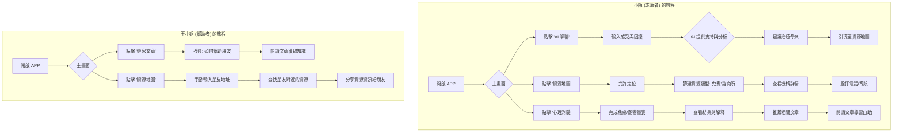
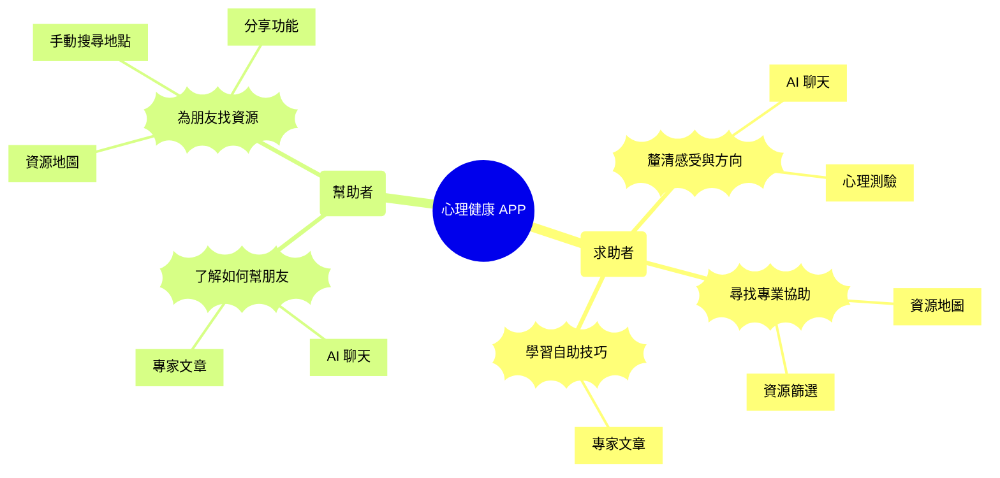

 Storybook
實驗

好的，完全理解您的需求。您希望看到更視覺化的流程圖，以及一份更詳盡、更貼近真實開發場景的 API 規格文件。

這很棒，表示我們正在從概念走向實作。

一、Mermaid 流程圖

我將您描述的 Workflow 和 User Story 轉換為 Mermaid 圖表，這樣可以更清晰地看到使用者路徑和功能關聯。

1. 使用者流程圖 (Workflow)

這張圖展示了兩位核心使用者（小陳-求助者，王小姐-幫助者）在 APP 中的主要操作路徑。
程式碼片段

flowchart TD
    subgraph 小陳 (求助者) 的旅程
        A[開啟 APP] --> B{主畫面};
        B --> C[點擊 'AI 聊聊'];
        C --> D[輸入感受與困擾];
        D --> E{AI 提供支持與分析};
        E --> F[建議治療學派];
        F --> G[引導至資源地圖];

        B --> H[點擊 '資源地圖'];
        H --> I[允許定位];
        I --> J[篩選資源類型: 免費/諮商所];
        J --> K[查看機構詳情];
        K --> L[撥打電話/導航];

        B --> M[點擊 '心理測驗'];
        M --> N[完成焦慮/憂鬱量表];
        N --> O[查看結果與解釋];
        O --> P[推薦相關文章];
        P --> Q[閱讀文章學習自助];
    end

    subgraph 王小姐 (幫助者) 的旅程
        R[開啟 APP] --> S{主畫面};
        S --> T[點擊 '專家文章'];
        T --> U[搜尋: 如何幫助朋友];
        U --> V[閱讀文章獲取知識];

        S --> W[點擊 '資源地圖'];
        W --> X[手動輸入朋友地址];
        X --> Y[查找朋友附近的資源];
        Y --> Z[分享資源資訊給朋友];
    end

2. 使用者故事與功能關聯圖 (User Story Map)

這張心智圖展示了使用者角色、他們的核心需求（User Story 的 "I want to..." 部分），以及滿足這些需求的功能。
程式碼片段

mindmap
  root((心理健康 APP))
    小陳 (求助者)
      ))釐清感受與方向((
        [AI 聊天]
        [心理測驗]
      ))尋找專業協助((
        [資源地圖]
        [資源篩選]
      ))學習自助技巧((
        [專家文章]
    王小姐 (幫助者)
      ))了解如何幫朋友((
        [AI 聊天]
        [專家文章]
      ))為朋友找資源((
        [資源地圖]
        [手動搜尋地點]
        [分享功能]

二、擴充版 API 規格 (Expanded API Spec)

這次我將提供更詳盡的規格，包含更豐富的端點、詳細的請求/回應欄位、錯誤處理和資料模型定義。

通用設計原則 (擴充)

    Base URL: https://api.yourdomain.com/v1

    Authentication: Authorization: Bearer <JWT> in HTTP Header.

    標準成功回應:
    JSON

{
  "success": true,
  "data": { ... } // or [ ... ]
}

標準錯誤回應:
JSON

    {
      "success": false,
      "error": {
        "code": "ERROR_CODE_STRING", // e.g., "INVALID_PARAMETERS"
        "message": "A human-readable error message."
      }
    }

資料模型 (Data Models)

預先定義共用的資料結構，讓 API 規格更清晰。

    Resource Model:
    JSON

{
  "id": "string (UUID)",
  "name": "string",
  "type": "enum (clinic, counseling_center, free_service, clinical_psychology)",
  "address": "string",
  "phone": "string",
  "website": "string (nullable)",
  "location": { "lat": "float", "lon": "float" },
  "description": "string",
  "specialties": ["string"], // e.g., ["CBT", "兒童諮商"]
  "isBookmarked": "boolean" // 當前使用者是否已收藏
}

Article Model:
JSON

    {
      "id": "string (UUID)",
      "title": "string",
      "author": { "name": "string", "title": "string" },
      "publishDate": "string (ISO 8601)",
      "summary": "string",
      "content": "string (HTML or Markdown)",
      "tags": ["string"],
      "isBookmarked": "boolean"
    }

1. 使用者 & 驗證 (Users & Auth)

Endpoint	Method	說明
/auth/register	POST	註冊匿名使用者
/users/me	GET	獲取當前使用者資訊

GET /users/me

    說明: 獲取當前登入使用者的基本資訊。

    Headers: Authorization: Bearer <JWT>

    Success Response (200 OK):
    JSON

    {
      "success": true,
      "data": {
        "userId": "user_uuid_string",
        "createdAt": "2025-09-13T12:00:00Z"
      }
    }

2. 資源地圖 (Resources)

Endpoint	Method	說明
/resources	GET	搜尋資源點
/resources/{id}	GET	獲取單一資源點詳情
/users/me/bookmarks/resources	GET	獲取使用者收藏的資源列表
/resources/{id}/bookmark	POST	收藏一個資源點
/resources/{id}/bookmark	DELETE	取消收藏一個資源點

GET /resources (擴充)

    Query Parameters:
    | 參數 | 類型 | 必要 | 說明 |
    | :--- | :--- | :--- | :--- |
    | lat | float | 是 | 緯度 |
    | lon | float | 是 | 經度 |
    | radius | int | 否 | 搜尋半徑(公尺)，預設 5000 |
    | type | string | 否 | 類型 (clinic, counseling_center...), 多選用逗號分隔 |
    | specialty | string | 否 | 專長 (CBT, ADHD...), 多選用逗號分隔 |

    Success Response (200 OK): 回應 data 欄位為一個 Resource Model 陣列。

POST /resources/{id}/bookmark

    說明: 將指定的資源點加入使用者的收藏。

    Headers: Authorization: Bearer <JWT>

    Path Parameters: id (string, required): 資源點的 ID。

    Success Response (204 No Content): 表示操作成功，無須返回內容。

3. AI 聊天 (AI Chat)

Endpoint	Method	說明
/chat/sessions	GET	獲取歷史聊天 session 列表
/chat/sessions	POST	建立新的聊天 session
/chat/sessions/{sessionId}/messages	GET	獲取某個 session 的歷史訊息
/chat/sessions/{sessionId}/messages	POST	發送訊息並取得回覆

GET /chat/sessions

    說明: 獲取使用者的歷史聊天列表，方便使用者回顧。

    Headers: Authorization: Bearer <JWT>

    Query Parameters: page (int, default: 1), limit (int, default: 20)

    Success Response (200 OK):
    JSON

    {
      "success": true,
      "data": [
        {
          "sessionId": "session_uuid_1",
          "firstMessageSnippet": "我最近常常失眠...",
          "lastUpdatedAt": "2025-09-12T10:30:00Z"
        }
      ]
    }

4. 心理測驗 (Quizzes)

Endpoint	Method	說明
/quizzes	GET	獲取測驗列表
/quizzes/{id}	GET	獲取測驗題目
/quizzes/{id}/submit	POST	提交答案並獲取結果
/users/me/quiz_history	GET	獲取使用者歷史測驗結果

GET /users/me/quiz_history

    說明: 讓使用者可以追蹤自己過去的測驗紀錄。

    Headers: Authorization: Bearer <JWT>

    Query Parameters: page (int, default: 1), limit (int, default: 10)

    Success Response (200 OK):
    JSON

    {
      "success": true,
      "data": [
        {
          "historyId": "history_uuid_1",
          "quizTitle": "GAD-7 焦慮自評量表",
          "completedAt": "2025-09-11T14:00:00Z",
          "score": 16,
          "result": "您的分數顯示您可能正經歷中重度的焦慮困擾。"
        }
      ]
    }

5. 專家文章 (Articles)

Endpoint	Method	說明
/articles	GET	搜尋文章
/articles/{id}	GET	獲取單篇文章詳情
/users/me/bookmarks/articles	GET	獲取使用者收藏的文章列表
/articles/{id}/bookmark	POST	收藏一篇文章
/articles/{id}/bookmark	DELETE	取消收藏一篇文章

GET /articles (擴充)

    Query Parameters:
    | 參數 | 類型 | 必要 | 說明 |
    | :--- | :--- | :--- | :--- |
    | q | string | 否 | 搜尋關鍵字 |
    | tag | string | 否 | 依標籤篩選 |
    | sort_by | string | 否 | 排序依據 (publishDate, popularity)，預設 publishDate |
    | page | int | 否 | 頁碼，預設 1 |
    | limit | int | 否 | 每頁數量，預設 10 |

    Success Response (200 OK): 回應 data 欄位為一個 Article Model 陣列 (不含 content 欄位)。

    擴充將圍繞以下幾個核心方向：

    完整的帳號系統：從匿名使用者過渡到完整的註冊會員，包含登入、註冊、密碼管理。

    使用者互動與回饋：新增評論、評分和內容回報機制。

    個人化與通知系統：讓使用者可以管理偏好設定，並接收推播通知。

    應用程式配置：提供一個中心化的端點來管理 APP 的動態設定。

    更嚴謹的規格定義：為每個欄位加上驗證規則，並定義更詳細的錯誤回應。

通用設計原則 (更新版)

    Base URL: https://api.yourdomain.com/v1

    Authentication:

        公開端點 (Public): 無需授權即可存取 (e.g., GET /articles)。

        授權端點 (Authorized): 需要 Authorization: Bearer <JWT> in HTTP Header。

    Pagination (分頁): 對於列表型 API (如文章、評論)，將使用以下分頁參數，並在回應中包含分頁資訊。

        Query Parameters: page (int, default: 1), limit (int, default: 15)。

        Response Body:
        JSON

    "pagination": {
      "currentPage": 1,
      "totalPages": 10,
      "totalItems": 150,
      "limit": 15
    }

標準錯誤回應 (更詳細):
JSON

    {
      "success": false,
      "error": {
        "code": "VALIDATION_ERROR",
        "message": "提供的輸入無效。",
        "details": { // 僅在 VALIDATION_ERROR 時出現
          "email": "請輸入有效的電子郵件地址。",
          "password": "密碼長度不能少於 8 個字元。"
        }
      }
    }

資料模型 (Data Models - 擴充)

    UserModel:
    JSON

{
  "id": "string (UUID)",
  "email": "string (nullable, for registered users)",
  "nickname": "string (nullable)",
  "isAnonymous": "boolean",
  "createdAt": "string (ISO 8601)"
}

ReviewModel:
JSON

{
  "id": "string (UUID)",
  "author": { // 簡化的 UserModel
    "id": "string (UUID)",
    "nickname": "string"
  },
  "resourceId": "string (UUID)",
  "rating": "integer (1-5)",
  "comment": "string (nullable)",
  "createdAt": "string (ISO 8601)",
  "canEdit": "boolean" // 當前使用者是否可編輯/刪除此評論
}

NotificationModel:
JSON

    {
      "id": "string (UUID)",
      "type": "enum (NEW_ARTICLE, PROMOTION, SYSTEM)",
      "title": "string",
      "body": "string",
      "isRead": "boolean",
      "createdAt": "string (ISO 8601)",
      "payload": { // 用於點擊通知後的操作
        "action": "NAVIGATE_TO_ARTICLE",
        "articleId": "article_uuid_1"
      }
    }

擴充 API 規格

1. 應用程式配置 (App Config)

Endpoint	Method	說明	授權
/config	GET	獲取 APP 的遠端配置	公開

GET /config

    說明: APP 啟動時呼叫，用來獲取動態設定，例如篩選條件列表、功能開關等，避免將設定寫死在前端。

    Success Response (200 OK):
    JSON

    {
      "success": true,
      "data": {
        "features": {
          "enableReviews": true, // 功能開關：是否啟用評論功能
          "enableTherapistProfiles": false
        },
        "filters": {
          "resourceTypes": [
            { "key": "clinic", "displayName": "身心科診所" },
            { "key": "counseling_center", "displayName": "心理諮商所" }
          ],
          "specialties": [
            { "key": "CBT", "displayName": "認知行為治療" },
            { "key": "ADHD", "displayName": "注意力不足過動症" }
          ]
        }
      }
    }

2. 完整帳號系統 (Full Auth System)

Endpoint	Method	說明	授權
/auth/register	POST	(更新) 註冊正式帳號	公開
/auth/login	POST	使用 Email 和密碼登入	公開
/auth/logout	POST	登出	需要
/users/me	PUT	更新使用者個人資料	需要
/users/me/password	PUT	變更密碼	需要
/users/me	DELETE	刪除帳號	需要

POST /auth/register (更新)

    說明: 註冊一個新的正式帳號。

    Request Body:
    | 欄位 | 類型 | 驗證規則 |
    | :--- | :--- | :--- |
    | email | string | required, email |
    | password | string | required, minLength:8 |
    | nickname | string | optional, maxLength:50 |

    Success Response (201 Created): 返回 UserModel 和 JWT Token。

    Error Response (409 Conflict): 當 Email 已被註冊時返回。

PUT /users/me

    說明: 更新使用者可修改的個人資料。

    Request Body:
    | 欄位 | 類型 | 驗證規則 |
    | :--- | :--- | :--- |
    | nickname | string | required, minLength:1, maxLength:50 |

    Success Response (200 OK): 返回更新後的 UserModel。

3. 使用者互動與回饋 (User Interaction & Feedback)

Endpoint	Method	說明	授權
/resources/{id}/reviews	GET	獲取某個資源點的所有評論	公開
/resources/{id}/reviews	POST	為某個資源點新增一則評論	需要
/reviews/{reviewId}	PUT	修改自己發布的評論	需要
/reviews/{reviewId}	DELETE	刪除自己發布的評論	需要
/report	POST	回報不當內容	需要

POST /resources/{id}/reviews

    說明: 使用者必須登入才能發表評論。

    Request Body:
    | 欄位 | 類型 | 驗證規則 |
    | :--- | :--- | :--- |
    | rating | integer | required, min:1, max:5 |
    | comment | string | optional, maxLength:1000 |

    Success Response (201 Created): 返回新建的 ReviewModel。

    Error Response (409 Conflict): 如果使用者已經評論過此資源點。

POST /report

    說明: 一個通用的內容回報端點。

    Request Body:
    | 欄位 | 類型 | 驗證規則 |
    | :--- | :--- | :--- |
    | contentType | enum | required, enum(review, article, resource) |
    | contentId | string | required, uuid |
    | reason | enum | required, enum(spam, inappropriate, incorrect_info) |
    | details | string | optional, maxLength:1000 |

    Success Response (202 Accepted): 表示伺服器已收到回報，將進行後續處理。

4. 個人化與通知系統 (Personalization & Notifications)

Endpoint	Method	說明	授權
/notifications	GET	獲取通知列表	需要
/notifications/mark-as-read	POST	將通知標示為已讀	需要
/users/me/notification-settings	GET	獲取通知設定	需要
/users/me/notification-settings	PUT	更新通知設定	需要
/users/me/push-token	POST	註冊/更新裝置的推播 token	需要

PUT /users/me/notification-settings

    說明: 讓使用者可以自訂想收到的通知類型。

    Request Body:
    JSON

    {
      "newArticle": true,
      "promotions": false,
      "systemUpdates": true
    }

    Success Response (200 OK): 返回更新後的設定。

POST /users/me/push-token

    說明: APP 取得推播權限後，將裝置 token 送到後端儲存。

    Request Body:
    | 欄位 | 類型 | 驗證規則 |
    | :--- | :--- | :--- |
    | token | string | required |
    | platform | enum | required, enum(ios, android) |

    Success Response (204 No Content):

    已完成功能 (Phase 1 & 2)
🏗️ 基礎架構
✅ 8個新的資料模型：Article, Quiz, Review, Notification, Bookmark, ChatSession, UserSetting, AppConfig
✅ 完整的 migration 檔案 (002_add_core_features.sql)
✅ 完整的 DTO/VO 結構 - 7個新的 DTO 檔案
✅ 更新的路由配置 - 支援所有新端點
👤 使用者管理系統
✅ GET /users/me - 獲取使用者資料
✅ PUT /users/me - 更新個人資料
✅ PUT /users/me/password - 變更密碼
✅ DELETE /users/me - 刪除帳號
✅ GET /users/me/stats - 使用者統計
📚 專家文章系統
✅ GET /articles - 搜尋文章 (支援關鍵字、標籤、排序)
✅ GET /articles/{id} - 文章詳情 (自動增加瀏覽次數)
✅ POST /articles/{id}/bookmark - 收藏文章
✅ DELETE /articles/{id}/bookmark - 取消收藏
🧠 心理測驗系統
✅ GET /quizzes - 獲取測驗列表
✅ GET /quizzes/{id} - 獲取測驗詳情和題目
✅ POST /quizzes/{id}/submit - 提交答案並獲取結果
✅ GET /users/me/quiz_history - 測驗歷史記錄
✅ 智能評分系統 - 支援 GAD-7, PHQ-9, 壓力量表
⭐ 收藏系統
✅ GET /users/me/bookmarks/articles - 文章收藏列表
✅ GET /users/me/bookmarks/resources - 資源收藏列表
✅ POST /bookmarks - 通用收藏功能
✅ DELETE /bookmarks - 取消收藏
💬 評論與評分系統
✅ GET /resources/{id}/reviews - 獲取資源評論 (含統計資訊)
✅ POST /resources/{id}/reviews - 新增評論
✅ PUT /reviews/{reviewId} - 修改評論
✅ DELETE /reviews/{reviewId} - 刪除評論
✅ POST /report - 回報不當內容
✅ 評分統計 - 平均評分和分佈圖
🔔 通知系統
✅ GET /notifications - 通知列表
✅ POST /notifications/mark-as-read - 標記已讀
✅ GET /users/me/notification-settings - 通知設定
✅ PUT /users/me/notification-settings - 更新通知設定
✅ POST /users/me/push-token - 推播 Token 管理
⚙️ 應用配置系統
✅ GET /config - 動態配置 (功能開關、篩選選項)
✅ 功能開關：評論、治療師資料、群組聊天等
✅ 篩選配置：資源類型、專業領域、測驗類別
