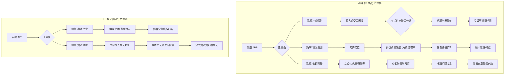
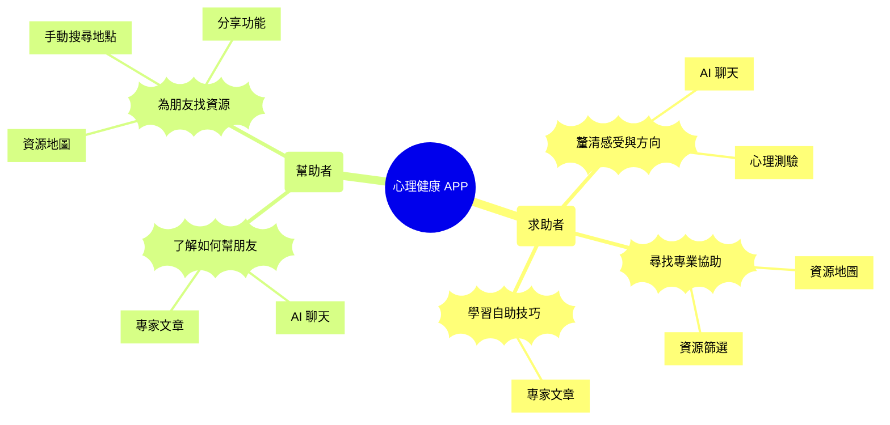

```mermaid
flowchart TD
    subgraph "小陳 (求助者) 的旅程"
        A[開啟 APP] --> B{主畫面};
        B --> C[點擊 'AI 聊聊'];
        C --> D[輸入感受與困擾];
        D --> E{AI 提供支持與分析};
        E --> F[建議治療學派];
        F --> G[引導至資源地圖];

        B --> H[點擊 '資源地圖'];
        H --> I[允許定位];
        I --> J[篩選資源類型: 免費/諮商所];
        J --> K[查看機構詳情];
        K --> L[撥打電話/導航];

        B --> M[點擊 '心理測驗'];
        M --> N[完成焦慮/憂鬱量表];
        N --> O[查看結果與解釋];
        O --> P[推薦相關文章];
        P --> Q[閱讀文章學習自助];
    end

    subgraph "王小姐 (幫助者) 的旅程"
        R[開啟 APP] --> S{主畫面};
        S --> T[點擊 '專家文章'];
        T --> U[搜尋: 如何幫助朋友];
        U --> V[閱讀文章獲取知識];

        S --> W[點擊 '資源地圖'];
        W --> X[手動輸入朋友地址];
        X --> Y[查找朋友附近的資源];
        Y --> Z[分享資源資訊給朋友];
    end
```

```mermaid
mindmap
  root((心理健康 APP))
    小陳 (求助者)
      ))釐清感受與方向((
        [AI 聊天]
        [心理測驗]
      ))尋找專業協助((
        [資源地圖]
        [資源篩選]
      ))學習自助技巧((
        [專家文章]
    王小姐 (幫助者)
      ))了解如何幫朋友((
        [AI 聊天]
        [專家文章]
      ))為朋友找資源((
        [資源地圖]
        [手動搜尋地點]
        [分享功能]
```